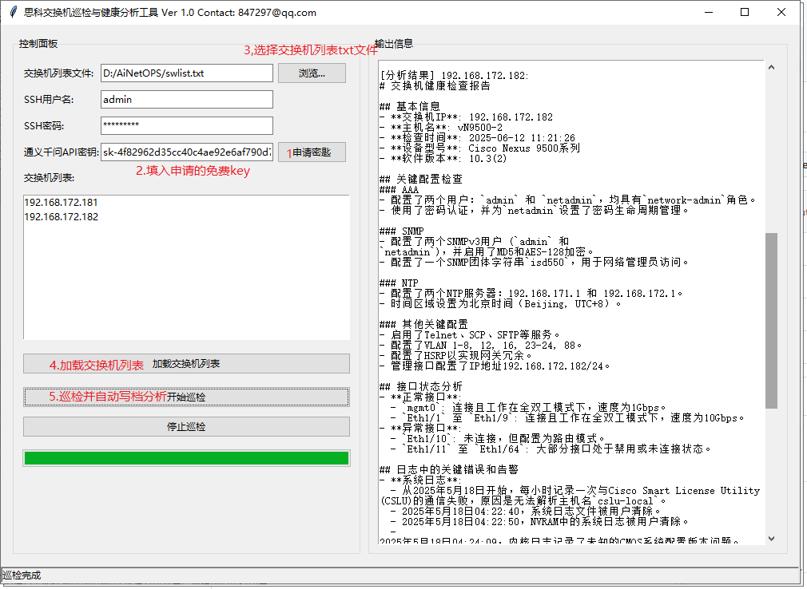

# Cisco_Inspection_AI_Assistant
Cisco_switch/Router Inspection_Assistat, have  Graphic UI .  接入阿里千问大模型自动分析巡检数据，AI_得到检查报告。

# requirements 要求

python 3.6.以上  Windows 10， 11， windows  server 2009

# run 运行

pip install -r requrement.txt

python main.py

# UI 界面

Contact: 847297@qq.com

目前已实现 思科， 华为多交换机的自动巡检日志分析和健康报告生成。（不在此发布的版本中）

